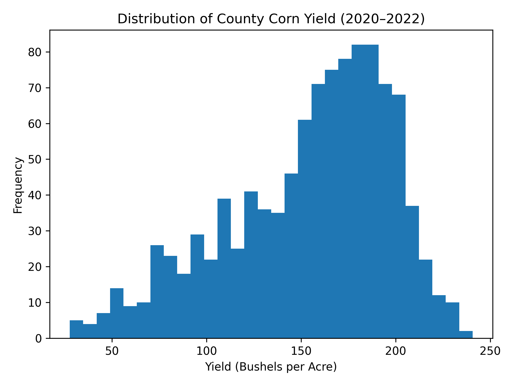
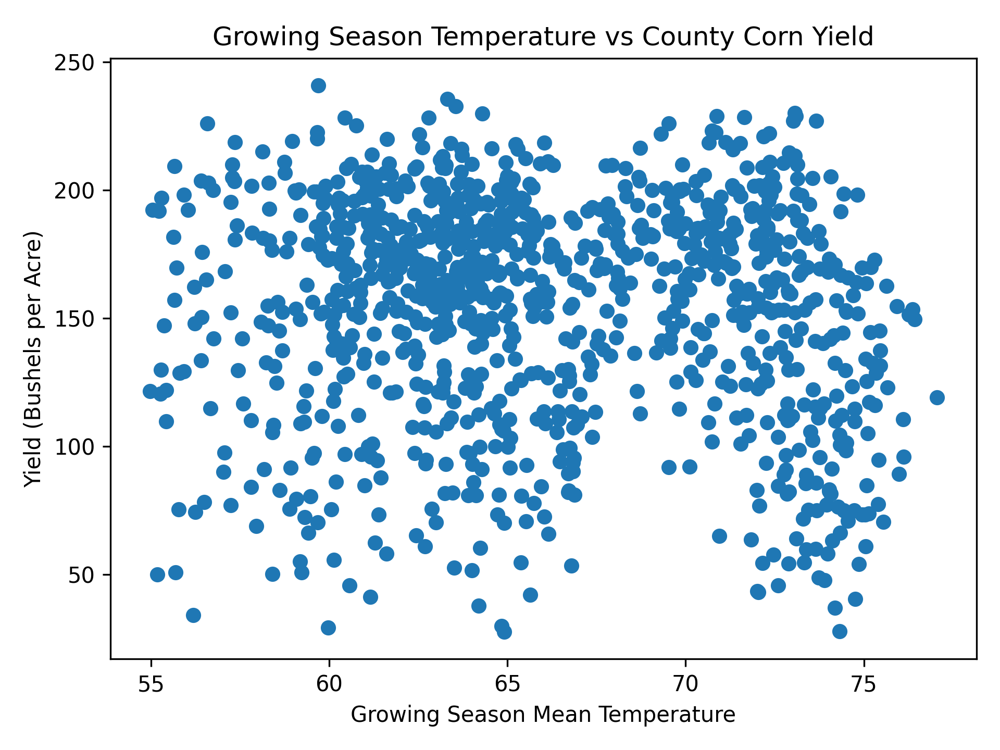
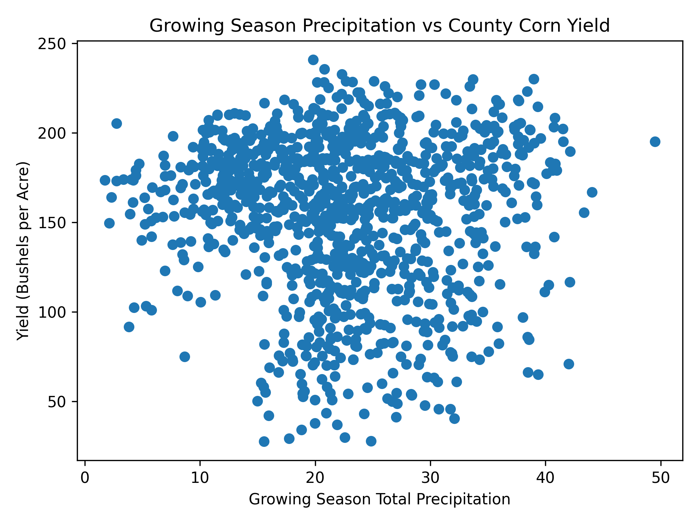
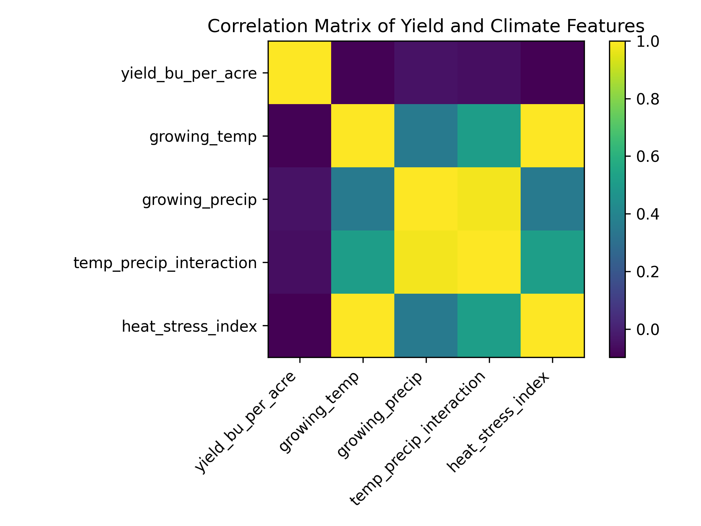
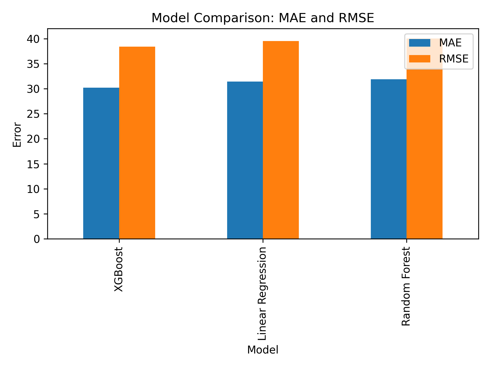

# 🌽 Agri-Vision US
### Climate-Based Prediction of U.S. Corn Yield Using Machine Learning

A data science project analyzing how **temperature and precipitation influence county-level corn yield across the United States**.

This project integrates **USDA agricultural statistics** with **PRISM climate data** and evaluates multiple machine learning models to estimate crop yield variability.

---

### 🔬 Key Results

• Final dataset: **1,060 county-year observations**

• Best performing model: **XGBoost**

| Model | MAE | RMSE | R² |
|------|------|------|------|
| XGBoost | 30.21 | 38.42 | 0.103 |
| Linear Regression | 31.45 | 39.52 | 0.051 |
| Random Forest | 31.90 | 40.02 | 0.027 |

Climate variables explain a portion of yield variability but additional agricultural factors are required for accurate prediction.

Raw Climate Data (PRISM)
          ↓
Climate Data Cleaning
          ↓
Growing Season Feature Engineering
          ↓
Merge with USDA Yield Data
          ↓
Train/Test Split
          ↓
Machine Learning Models
   • Linear Regression
   • Random Forest
   • XGBoost
          ↓
Model Evaluation
   • MAE
   • RMSE
   • R²
          ↓
Insights & Visualizations

# Key Visualizations

## Yield Distribution

---

## Temperature vs Yield

---

## Precipitation vs Yield

---

## Climate Correlation Matrix

---

## Model Performance Comparison

